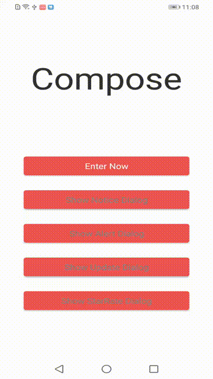

### 简单方便入门的JetPack Compose框架项目，可直接做基本框架使用
#### 本基础框架演示了compose基础用法，主要包含路由管理做页面跳转，页面间的传参和回参，网络请求调用演示
#### 当然，像网络请求不喜欢用retrofit，也可以换成其他的，非常简单，具体可Clone下来瞧瞧，非常easy
>>> 项目具体参照了leavesC老哥的 [https://github.com/leavesC/compose_chat]() ，在此感谢
> 效果图如下:
> 